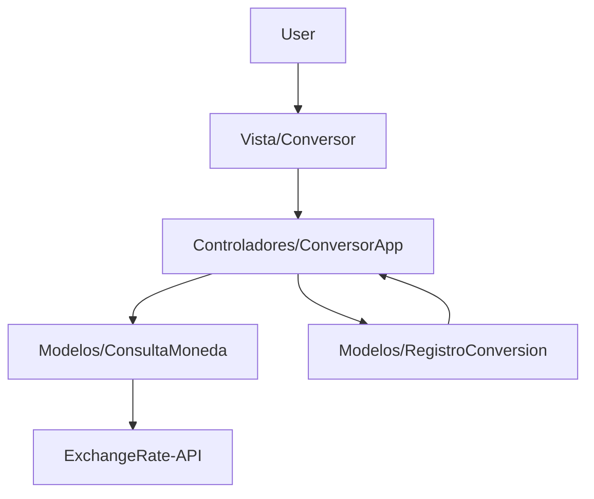
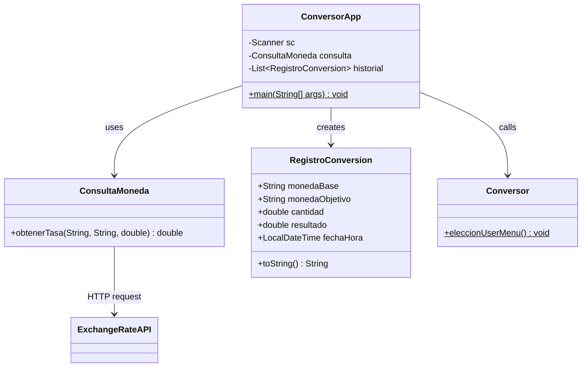
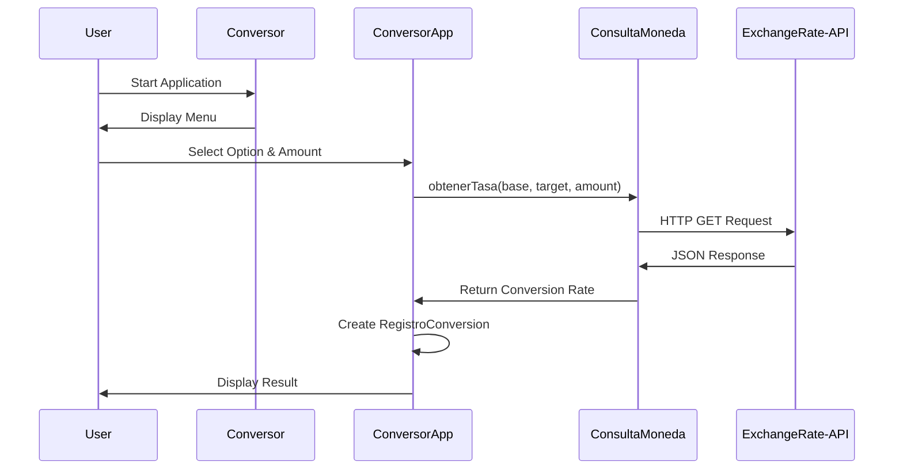

## Overview

The Currency Converter application follows the **Model-View-Controller (MVC)** architectural pattern, implementing object-oriented programming (OOP) principles to ensure clean separation of concerns and maintainable code.

## MVC Pattern Implementation

The application is structured into three distinct layers, each with specific responsibilities:



### Controller Layer (Controladores)

**Package:** `lad.com.alura.conversormoneda.controladores`

The controller layer orchestrates application flow and business logic.

<CodeGroup>
```java ConversorApp.java
public class ConversorApp {
    public static void main(String[] args) {
        Scanner sc = new Scanner(System.in);
        // Instantiate service (OOP principle)
        ConsultaMoneda consulta = new ConsultaMoneda();
        // Create history list
        List<RegistroConversion> historial = new ArrayList<>();
        // Main application loop
    }
}
```
</CodeGroup>

**Responsibilities:**
- Application entry point (`main` method)
- User input handling and validation
- Orchestrating interactions between View and Model
- Managing conversion history
- Business logic for currency pair selection

### Model Layer (Modelos)

**Package:** `lad.com.alura.conversormoneda.modelos`

The model layer contains business entities and service classes.

#### ConsultaMoneda (Service)

Handles external API communication and data retrieval.

```java
public class ConsultaMoneda {
    public double obtenerTasa(String monedaBase, 
                             String monedaObjetivo, 
                             double cantidad) {
        // HTTP client implementation
        // API request and response handling
    }
}
```

#### RegistroConversion (Entity)

Immutable data structure using Java 14+ `record` feature.

```java
public record RegistroConversion(
    String monedaBase, 
    String monedaObjetivo, 
    double cantidad, 
    double resultado, 
    LocalDateTime fechaHora
) {
    @Override
    public String toString() {
        // Custom formatting for display
    }
}
```

### View Layer (Vista)

**Package:** `lad.com.alura.conversormoneda.vista`

The view layer handles user interface and presentation logic.

```java
public class Conversor {
    public static void eleccionUserMenu() {
        // Display menu using text blocks (Java 13+)
    }
}
```

**Responsibilities:**
- User interface presentation
- Menu display
- User interaction prompts

## Package Structure

```
src/lad/com/alura/conversormoneda/
├── controladores/
│   └── ConversorApp.java       # Main controller and entry point
├── modelos/
│   ├── ConsultaMoneda.java     # API service class
│   └── RegistroConversion.java # Data entity (record)
└── vista/
    └── Conversor.java          # User interface
```

## Class Relationships

<Tabs>
  <Tab title="Class Diagram">

  </Tab>
  <Tab title="Sequence Diagram">

  </Tab>
</Tabs>

## Design Decisions

### Object-Oriented Programming (OOP) Principles

#### Encapsulation

<Card title="Service Encapsulation" icon="shield">
The `ConsultaMoneda` class encapsulates all API communication logic, hiding implementation details from the controller.

```java
// Instance-based design (not static)
ConsultaMoneda consulta = new ConsultaMoneda();
double resultado = consulta.obtenerTasa(base, objetivo, cantidad);
```
</Card>

#### Single Responsibility Principle (SRP)

Each class has a single, well-defined responsibility:

- **ConversorApp**: Application orchestration and flow control
- **ConsultaMoneda**: External API communication
- **RegistroConversion**: Data representation
- **Conversor**: User interface presentation

#### Immutability

<Card title="Java Records" icon="lock">
The `RegistroConversion` record provides immutable data structures, ensuring thread safety and preventing accidental modifications.

```java
public record RegistroConversion(
    String monedaBase,
    String monedaObjetivo,
    double cantidad,
    double resultado,
    LocalDateTime fechaHora
) { }
```
</Card>

### Modern Java Features

The application leverages several modern Java features:

<CardGroup cols={2}>
  <Card title="Records (Java 14+)" icon="database">
    Immutable data carriers with automatic constructors, getters, `equals()`, `hashCode()`, and `toString()`
  </Card>
  <Card title="Text Blocks (Java 13+)" icon="align-left">
    Multi-line string literals for cleaner menu formatting
  </Card>
  <Card title="Switch Expressions (Java 14+)" icon="code-branch">
    Enhanced switch with `yield` for cleaner conditional logic
  </Card>
  <Card title="Lambda Expressions (Java 8+)" icon="function">
    Functional programming for history display: `historial.forEach(System.out::println)`
  </Card>
</CardGroup>

## Data Flow

1. **User Input**: User selects currency pair and enters amount
2. **Controller Processing**: `ConversorApp` processes the selection using switch expressions
3. **Service Call**: Controller invokes `ConsultaMoneda.obtenerTasa()`
4. **API Request**: Service makes HTTP request to ExchangeRate-API
5. **Response Parsing**: JSON response parsed using Gson
6. **History Recording**: Conversion saved as `RegistroConversion` with timestamp
7. **Result Display**: Converted amount displayed to user

<Info>
  The application maintains in-memory history using `ArrayList<RegistroConversion>`, which persists only during the application session.
</Info>

## Error Handling Strategy

The application implements graceful error handling:

- API failures return `0` with error message
- Invalid menu selections prompt retry
- Exception catching prevents application crashes

```java
try {
    // API communication logic
} catch (Exception e) {
    System.out.println("Error al conectar con la API: " + e.getMessage());
    return 0;
}
```

<Warning>
  The current implementation returns `0` on API errors, which could be confused with a legitimate conversion result. Consider using `Optional<Double>` or throwing custom exceptions for production applications.
</Warning>